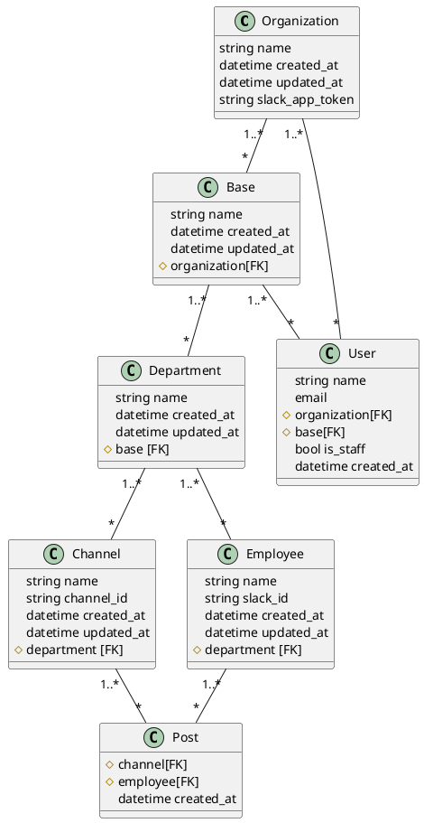

# SlackAnalyticsAPIクラス図
## 注意
本クラス図はplantUMLを用いてVScodeにてプレビュー表示することを想定しております。  
以下の拡張機能VScodeにインストールしてこちらのファイルを開いてください。

- PlantUML
- Markdown Preview Enhanced

また下記のコマンドを用いてGraphvizをインストールしてください。(MacOSの場合)

    brew install graphviz

WindowsOSの場合はこちらからダウンロードできます。
[Graphviz](https://graphviz.gitlab.io/)

## クラス図

