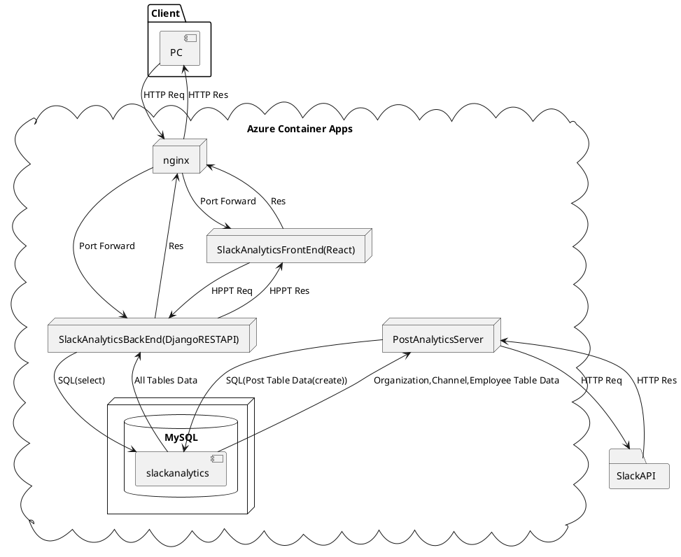

# SlackAnalytics構成図
## 注意
本構成図はplantUMLを用いて作成しております。  
### Choromeで閲覧する場合
拡張機能をインストールしてください。  
- [Pegmatite - Chrome ウェブストア](https://chrome.google.com/webstore/detail/pegmatite/jegkfbnfbfnohncpcfcimepibmhlkldo)

### VScodeで閲覧する場合
以下の拡張機能VScodeにインストールしてこちらのファイルを開いてください。

- PlantUML
- Markdown Preview Enhanced

また下記のコマンドを用いてGraphvizをインストールしてください。(MacOSの場合)

    brew install graphviz

WindowsOSの場合はこちらからダウンロードできます。
[Graphviz](https://graphviz.gitlab.io/)

## 構成図

